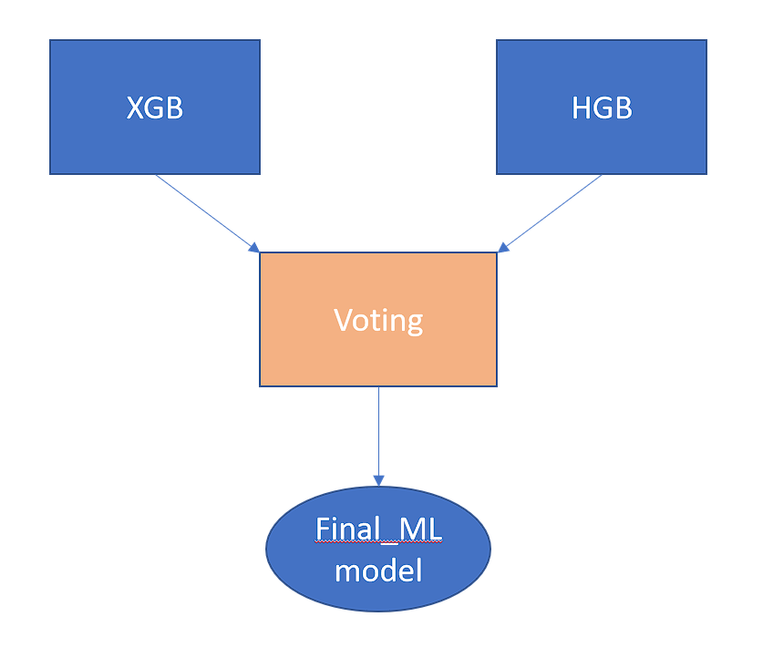
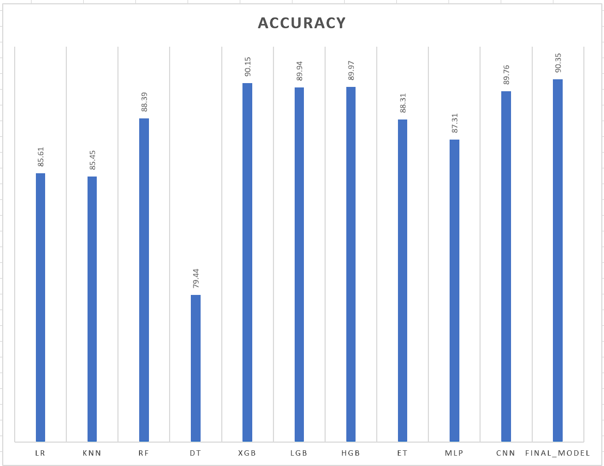

# Project Name

Classification work of NITEX. Here I have shown both ML and DL models. Both of them have the accuracy of 90% though the proposed ML model has the highest accuracy but the difference is not so much so that's why i implemented both here. 

## Installation

1. Clone the repository.
2. Install required dependencies from `requirements.txt`.
3. Firstly, Run the mode_train.py file for training the model. You can choose the ML model or DL model.

4. Secondly, Run the evaluate_model.py to see the accuracy score, classification report and confusion matrx of the testing data.
Again you have to choose if you want to see the evaluation of Ml model or DL model.

python evaluate_model.py --test-data "path_to_test_data.csv" if you want different test data to be tested run this command in the command line.

## Why this model?
ML model has performed better for this dataset.

The final model has the highest accuracy that's why it is choosen for this classification. It is a ensemble model of XGB and HGB model. The ensemble is done by the help of Voting classifier. 

The accuracy of the CNN model and the other ML models mentioned here is shown in the folder CNN and ML_models.